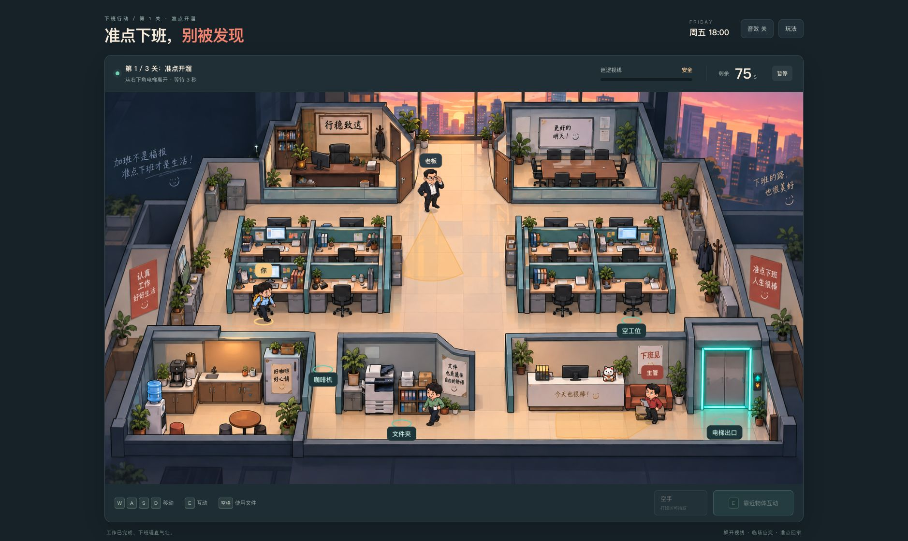

# 准点下班，别被发现 · Clock Out Unseen

一款三关办公室潜行小游戏：工作做完了，躲开主管和老板的视线，借助咖啡机、文件夹和空工位，赶在倒计时结束前进入电梯。

**版本说明：当前源码为 V2；下方 B站试玩和截图仍是已发布的 V1。V2 尚未部署到该试玩地址。** [V2 更新说明](docs/V2更新说明.md)

**[直接试玩 · Play in browser](https://www.bilibili.com/toy/clockout-unseen/index.html)** · [开发记录与 GPT-6 Astra 的参与](docs/DEVELOPMENT.md)



*A three-level office stealth game. Avoid patrol sightlines, distract the supervisor, disguise yourself with a folder, and reach the elevator before time runs out.*

作者 / Creator: [Ryan-fm](https://github.com/Ryan-fm)。单人、中文界面，支持电脑键盘和手机触控。浏览器直接运行，无须安装或配置 API Key；游戏本身无登录或付费机制，线上入口由 B站 Toy 托管。

## 玩法与操作

- WASD / 方向键：移动；手机使用左侧摇杆。
- E / 互动按钮：取文件、坐下伪装、呼叫或进入电梯、开启咖啡机。
- 空格 / 文件夹按钮：消耗文件夹，按难度获得 6 / 4 / 2.5 秒伪装，必须在暴露之前使用。
- Esc / 暂停按钮：暂停；切换窗口自动暂停。
- 无掩体或伪装保护时，被主管或老板看见立即失败，本关冻结后可重试。

V2 的三关分别使用开放办公区、会议中心、行政楼层，地图世界坐标均为 3000 × 2000，配备跟随镜头、小地图和全场景图鉴。巡逻随机选择可达目标及停顿时间，重试重新随机。

| 模式 | 每层巡查人数 | 文件伪装 | 每关楼层 |
| --- | --- | --- | --- |
| 普通 | 2 | 6 秒 | 1 |
| 变态 | 3 | 4 秒 | 1 |
| 地狱 | 6 | 2.5 秒 | 2 |

每层另有一名同事。普通模式三关限时为 150 / 140 / 130 秒；更难模式会调整计时、巡逻速度、视距和电梯等待。地狱模式两层共用本关计时，第一部电梯换层，第二部电梯通关，换层说明期间暂停计时。失败重试当前关第一层，保留此前通关记录。最快成绩按难度保存在本机，无云存档或在线排行榜。

## 本地运行 / Development

建议 Node.js 22.12+。

```sh
npm ci
npm run dev -- --host 127.0.0.1 --port 4186 --strictPort
```

打开终端输出的本地地址。

```sh
npm test
npm run build
npm run preview -- --host 127.0.0.1
```

生产静态文件在 `dist/client/`。资源使用相对路径，可部署到网站子目录。Sites 兼容构建还会生成 `dist/server/` 和托管元信息；上传 Toy 时只使用 `dist/client/`。

## 技术与文件

React 19、Vite 6、Canvas 2D、Web Audio。无需游戏服务端。

- `src/maps.js`：三张地图的碰撞、互动点、出生点和难度配置。
- `src/engine.js`：移动碰撞、视野遮挡、巡逻、道具、三关状态。
- `src/App.jsx` / `src/styles.css`：Canvas 画面、HUD、键盘与触控交互。
- `public/assets/`：办公室背景、人物和坐姿素材。
- `tests/`：11 项 V2 游戏逻辑测试与 4 项托管构建检查。
- `prompts/`：美术生成提示词。
- `docs/DEVELOPMENT.md`：开发过程、模型参与、验证范围与限制。

## 素材说明

办公室及人物美术通过 Codex 的图像生成工具制作，玩法代码通过 GPT-6 Astra 在 Codex 中迭代实现。项目不是一次提示生成；玩法、检测规则和关卡数量根据实际反馈修改。美术生成与代码模型的贡献分别记录，见开发说明。
